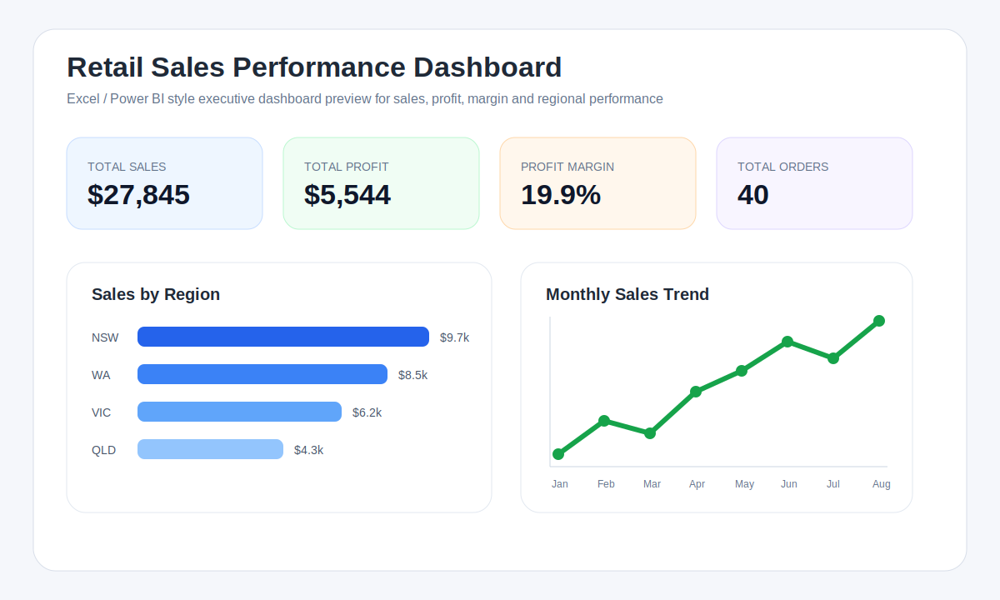

# Data Analytics & Business Intelligence Portfolio

**Portfolio focus:** Data Analysis | Business Intelligence | SQL | Excel | Python | Power BI | Dashboard Reporting

This repository presents practical demonstration projects aligned with Data Analyst, Reporting Analyst and Business Intelligence roles. The projects show how raw business data can be cleaned, analysed, modelled and converted into dashboard-ready insights for decision-making.

## Portfolio Snapshot



## Featured Projects

| Project | Business Scenario | Tools | Evidence Included |
|---|---|---|---|
| [Retail Sales Excel Dashboard](project-01-retail-sales-excel-dashboard) | A medium-sized retail business needs sales, profit, region and category reporting. | Excel, PivotTables, KPI reporting, dashboard design | Dataset, dashboard design guide, KPI formulas, visual dashboard preview |
| [Power BI Retail Performance Dashboard](project-02-power-bi-retail-performance-dashboard) | Managers need an interactive BI dashboard for revenue, margin, products and regions. | Power BI, DAX, data modelling, visualisation | DAX measures, dashboard requirements, KPI definitions, data governance notes |
| [SQL Customer & Revenue Analysis](project-03-sql-customer-revenue-analysis) | A business needs SQL queries to understand customers, sales trends, discount risk and margin performance. | SQL, joins, aggregation, filtering, CASE logic | Business questions, SQL query file, KPI and data-quality checks |
| [Python Data Cleaning & Insights](project-04-python-data-cleaning-insights) | Customer-support data needs cleaning, validation, KPI reporting and stakeholder summaries. | Python, pandas, data cleaning, reporting automation | Dataset, Python script, data-quality checks, KPI summaries |

## Live Dashboard Demo

A browser-based dashboard demo is available in the `docs` folder:

- [`docs/index.html`](docs/index.html) — portfolio landing page
- [`docs/retail-dashboard.html`](docs/retail-dashboard.html) — retail dashboard demo

To view the HTML dashboard as a web page, enable **GitHub Pages** from the repository settings and select the `docs` folder as the Pages source.

## Skills Demonstrated

- Data cleaning and validation
- KPI reporting and performance monitoring
- Excel dashboard planning and PivotTable-ready data preparation
- Power BI dashboard design and DAX measure planning
- SQL business analysis and revenue reporting
- Python data cleaning using pandas
- Data documentation, assumptions and KPI definitions
- Stakeholder-friendly reporting and business insight communication
- Dashboard-ready dataset preparation
- Data quality checks and repeatable reporting workflows

## Repository Structure

```text
data-analytics-portfolio/
├── README.md
├── docs/
│   ├── index.html
│   └── retail-dashboard.html
├── project-01-retail-sales-excel-dashboard/
│   ├── data/
│   ├── dashboard/
│   ├── images/
│   ├── notebooks/
│   ├── excel-dashboard-design.md
│   └── README.md
├── project-02-power-bi-retail-performance-dashboard/
│   ├── dashboard-requirements.md
│   ├── power-bi-dax-measures.md
│   └── README.md
├── project-03-sql-customer-revenue-analysis/
│   ├── sql/
│   └── README.md
└── project-04-python-data-cleaning-insights/
    ├── data/
    ├── scripts/
    └── README.md
```

## How a Recruiter or Hiring Manager Can Review This Portfolio

1. Start with the project table above.
2. Open the retail sales project to review dashboard planning and KPI logic.
3. Review the SQL project for query-writing and business-question analysis.
4. Review the Python project for data cleaning and reporting workflow.
5. Review the Power BI project for dashboard requirements, DAX measures and BI documentation.

## Professional Positioning

This portfolio supports applications for:

- Data Analyst
- Reporting Analyst
- Business Intelligence Analyst
- Junior Business Analyst
- Insights Analyst
- Commercial Analyst
- Operations Analyst

## Portfolio Status

The repository currently includes sample datasets, SQL queries, Python scripts, DAX measures, dashboard documentation, HTML dashboard demos and visual dashboard previews. Excel workbook and Power BI `.pbix` files can be added as downloadable artefacts after being created or exported from the relevant desktop tools.
